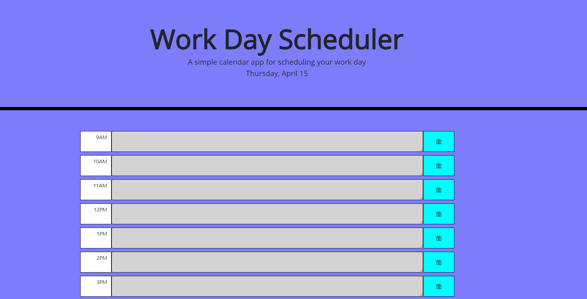

# Day-planner



Description
------------

Day planner of a 9-5 schedule. Allows for storage of input within each text box as long as the save button is clicked. Information will remain in the textboxes even after the browser is closed. 

 Table of contents
---------------
[Tools used](#Tools-used)<br />
[Deployed here](#Deployed-here)<br />
[Features](#Features)
* [Current day](#Current-day)
* [Color changing rows](#Color-changing-rows)
* [Input saved to local storage](#Input-saved-to-local-storage)


[Credits](#Credits)<br />
[License](#License)

Tools used
-------------------

* Bootstrap - Has premade layouts and components useful for making a webpage without having to start from scratch. 
* CSS - Style the page with custom colors, and spacing.
* Day.js - Time CDN with functions that can call various dates and times.
* Font awesome - Contains plenty of icons for use in webpage.
* GitBash - Assist with version control via commits, push, and pull to and from GitHub.
* GitHub - Site where the repository lies for deployment and edits.
* Google fonts - Font that can be seen on any OS.
* HTML - Contains the base of the webpage and allows browsers to interpret the code as a webpage.
* JavaScript - Houses all of the functions for this webpage. 
* JQuery - Quality of life features and shortcuts when creating javascript code. 
* VS Code - Application used to write and edit code for the webpage.

Deployed here
-------------

Below is the link to the deployed webpage. <br />
[Link to site](https://vincent-nguyen8931.github.io/Day-planner/)


Features
------------------

Current day
-----------------------

Based on Day.js documents, I used the format function below to set the time to display the day of the week, month, and day number. This is appended to the header.
```
$("#headerRow").append("<h2>" + dayjs().format("dddd, MMMM D") + "</h2>");
```

Color changing rows
---------------
Each textbox will change colors depending on the current time. Any time before the current time will be light grey, and times after the current time will be green. The current time will be red.
```
for (i = 1; i < 10; i++) {
  // if statement checks for current time being greater than the array of possible times. When true, the row is given the class "past" to represent a past time.
  if (currentTime > possibleTimes[i]) {
    $("#textArea" + i).addClass("past");
  }
  // if statement checks for current time being less than the array of possible times. When true, the row is given the class "future" to represent a future time.
  else if (currentTime < possibleTimes[i]) {
    $("#textArea" + i).addClass("future");
  }
  // if neither of the above are true, then the class "present" will be added to make that row be considered the present time.
  else {
    $("#textArea" + i).addClass("present");
  }
}
```

Input saved to local storage
-----------
This feature required two parts, one to store the input and one to retrieve it. This first snippet is how the text in the textarea is stored into a key created for each row. The variables in the snippet are set by the checkRow function, changing the various variables to their needed information via switch statement.
```
// function sets rowClicked to the saveIcon + i from the for loop above. when entering function checkRow, rowClicked will become the local storage name, and rowSelected will become the text area id which is used to pull the user's input into local storage via the setJSON function.
function saveInput() {
  rowClicked = this.id;
  checkRow();
  setJSON(rowClicked, $(rowSelected).val());
}
```
The setJSON function creates a key and stringify its value.
```
// function to save a value to specified key
function setJSON(key, value) {
  window.localStorage.setItem(key, JSON.stringify(value));
}
```
The second part of this feature is to call the information from local storage. This is performed on page load and the for loop will iterate through every row and place information from local storage into the textarea if any information is present. The storageLocation variable is set to the getJSON function call. The checkRow function is called for the same reason as the input storage snippet.
```
// retrieves all information in local storage based on the "events" keys and stores them in their proper row.
  for (i = 1; i < 10; i++) {
    rowClicked = "saveIcon" + i;
    checkRow();
    $(rowSelected).val(storageLocation)
  }

```
The getJSON function recalls a value based on the key passed into it.
```
// function to recall a value from specified key
function getJSON(key) {
  return JSON.parse(window.localStorage.getItem(key));
}
```


Credits
---------------
LinkedIn: [https://www.linkedin.com/in/vincent-nguyen-74226a107/](https://www.linkedin.com/in/vincent-nguyen-74226a107/) <br />
GitHub: [https://github.com/vincent-nguyen8931](https://github.com/vincent-nguyen8931)


License
----------
MIT License

Copyright (c) [2020] [Vincent Nguyen]

Permission is hereby granted, free of charge, to any person obtaining a copy
of this software and associated documentation files (the "Software"), to deal
in the Software without restriction, including without limitation the rights
to use, copy, modify, merge, publish, distribute, sublicense, and/or sell
copies of the Software, and to permit persons to whom the Software is
furnished to do so, subject to the following conditions:

The above copyright notice and this permission notice shall be included in all
copies or substantial portions of the Software.

THE SOFTWARE IS PROVIDED "AS IS", WITHOUT WARRANTY OF ANY KIND, EXPRESS OR
IMPLIED, INCLUDING BUT NOT LIMITED TO THE WARRANTIES OF MERCHANTABILITY,
FITNESS FOR A PARTICULAR PURPOSE AND NONINFRINGEMENT. IN NO EVENT SHALL THE
AUTHORS OR COPYRIGHT HOLDERS BE LIABLE FOR ANY CLAIM, DAMAGES OR OTHER
LIABILITY, WHETHER IN AN ACTION OF CONTRACT, TORT OR OTHERWISE, ARISING FROM,
OUT OF OR IN CONNECTION WITH THE SOFTWARE OR THE USE OR OTHER DEALINGS IN THE
SOFTWARE.